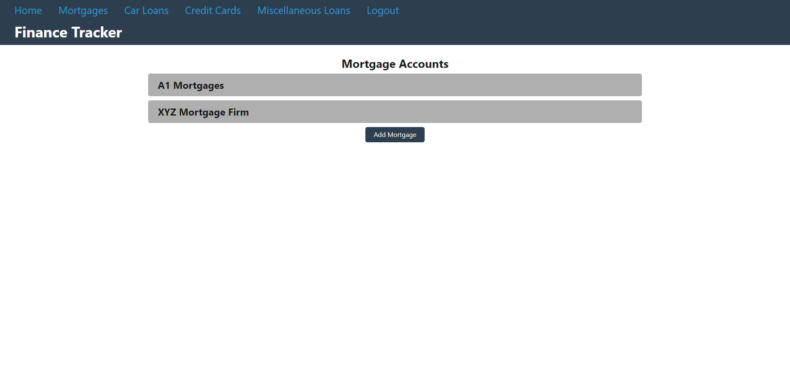
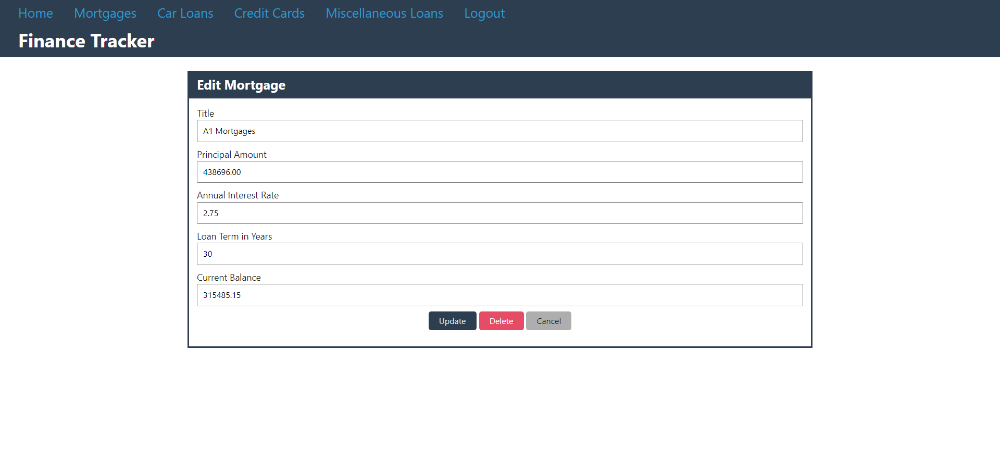
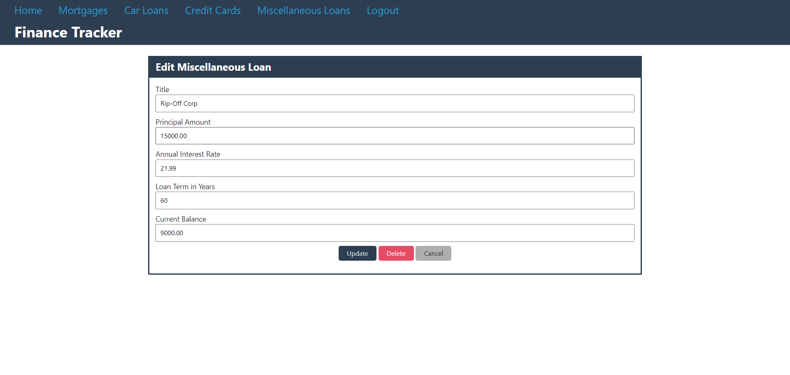

# Finance Tracker
[](https://opensource.org/licenses/ISC)

## Description
This project is a finance tracker that allows users to create user accounts, and create, update, and delete financial accounts. It currently handles bank accounts, mortgages, car loans, miscellaneous loans, credit cards, 401Ks, IRAs, CDs, and brokerage accounts. It does not keep track of account numbers, just various monetary values and percentages. It was created using HTML, CSS, JavaScript, Node.js, Express.js, Handlebars.js, MySQL, BCrypt, Sequelize, and Sequelize Session.

## Screenshots
| Landing page |
| - |
| [](public/images/finance-tracker-initial-view.png) |

| Login page | Signup page |
| - | - |
| [](public/images/finance-tracker-login-page.png) | [](public/images/finance-tracker-signup-page.png) |

| Mortgage page before accounts are added | Add mortgage page |
| - | - |
| [](public/images/finance-tracker-mortgage-page-blank.png) | [](public/images/finance-tracker-add-mortgage-page.png) |

| Mortgage page with accounts | Edit mortgage page |
| - | - |
| [](public/images/finance-tracker-mortgage-page.png) | [](public/images/finance-tracker-edit-mortgage-page.png) |

| Car loan page before accounts are added | Add car loan page |
| - | - |
| [](public/images/finance-tracker-car-loan-page-blank.png) | [](public/images/finance-tracker-add-car-loan-page.png) |

| Car loan page with accounts | Edit car loan page |
| - | - |
| [](public/images/finance-tracker-car-loan-page.png) | [](public/images/finance-tracker-edit-car-loan-page.png) |

| Miscellaneous loan page before accounts are added | Add miscellaneous loan page |
| - | - |
| [](public/images/finance-tracker-misc-loan-page-blank.png) | [](public/images/finance-tracker-add-misc-loan-page.png) |

| Miscellaneous loan page with accounts | Edit miscellaneous loan page |
| - | - |
| [](public/images/finance-tracker-misc-loan-page.png) | [](public/images/finance-tracker-edit-misc-loan-page.png) |

| Credit card page before accounts are added | Add credit card page |
| - | - |
| [](public/images/finance-tracker-credit-card-page-blank.png) | [](public/images/finance-tracker-add-credit-card-page.png) |

| Credit card page with accounts | Edit credit card page |
| - | - |
| [](public/images/finance-tracker-credit-card-page.png) | [](public/images/finance-tracker-edit-credit-card-page.png) |

| Home page before accounts are added | Home page after accounts are added |
| - | - |
| [](public/images/finance-tracker-home-page-blank.png) | [](public/images/finance-tracker-home-page.png) |

## Installation
Clone this repository, go to the repository folder in the terminal, and then run the following command

```
npm i
```

You must have MySQL installed, log into the MySQL command line client, and run

```
source db/schema.sql;
```

In addition, a .env file must be created in the root of the project containing the following code:

```
DB_NAME='finance_db'
DB_USER='username'
DB_PASSWORD='password'
```

Change username and password to your MySQL username and password.

Start the app in the terminal using

```
npm start
```

and open a browser window and go to http://localhost:3001/

## Questions
If you have questions about this repo, open an issue or contact me directly at todd@weloveeats.com. You can find more of my work at [tharveyster](https://github.com/tharveyster).

## License
ISC

Copyright 2021 Todd Harvey

Permission to use, copy, modify, and/or distribute this software for any purpose with or without fee is hereby granted, provided that the above copyright notice and this permission notice appear in all copies.

THE SOFTWARE IS PROVIDED "AS IS" AND THE AUTHOR DISCLAIMS ALL WARRANTIES WITH REGARD TO THIS SOFTWARE INCLUDING ALL IMPLIED WARRANTIES OF MERCHANTABILITY AND FITNESS. IN NO EVENT SHALL THE AUTHOR BE LIABLE FOR ANY SPECIAL, DIRECT, INDIRECT, OR CONSEQUENTIAL DAMAGES OR ANY DAMAGES WHATSOEVER RESULTING FROM LOSS OF USE, DATA OR PROFITS, WHETHER IN AN ACTION OF CONTRACT, NEGLIGENCE OR OTHER TORTIOUS ACTION, ARISING OUT OF OR IN CONNECTION WITH THE USE OR PERFORMANCE OF THIS SOFTWARE.
